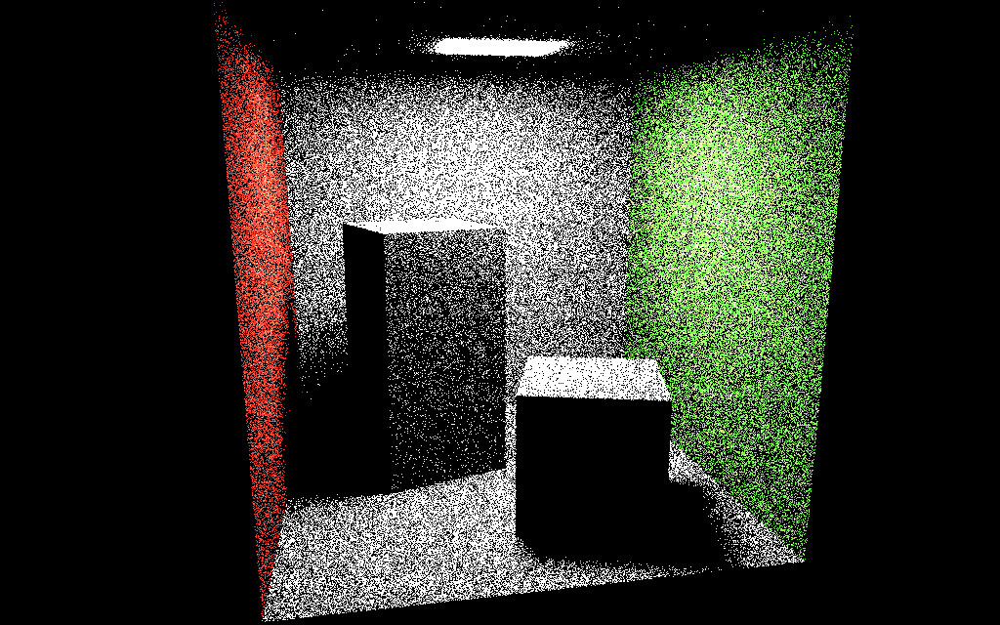
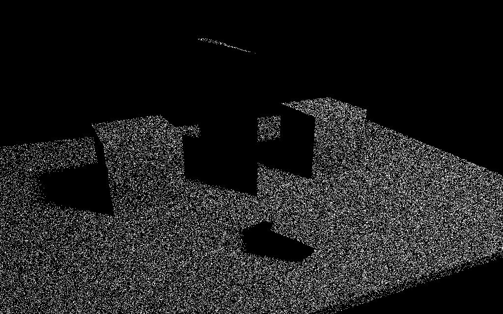
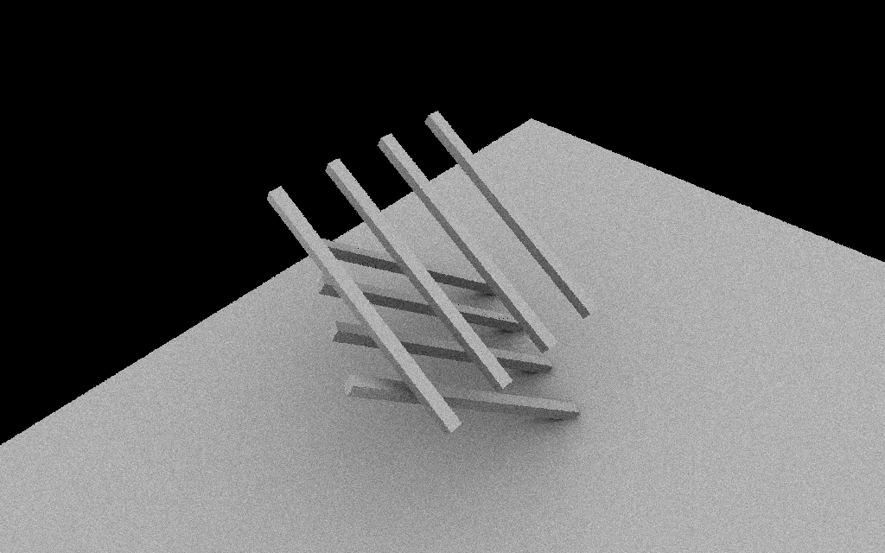
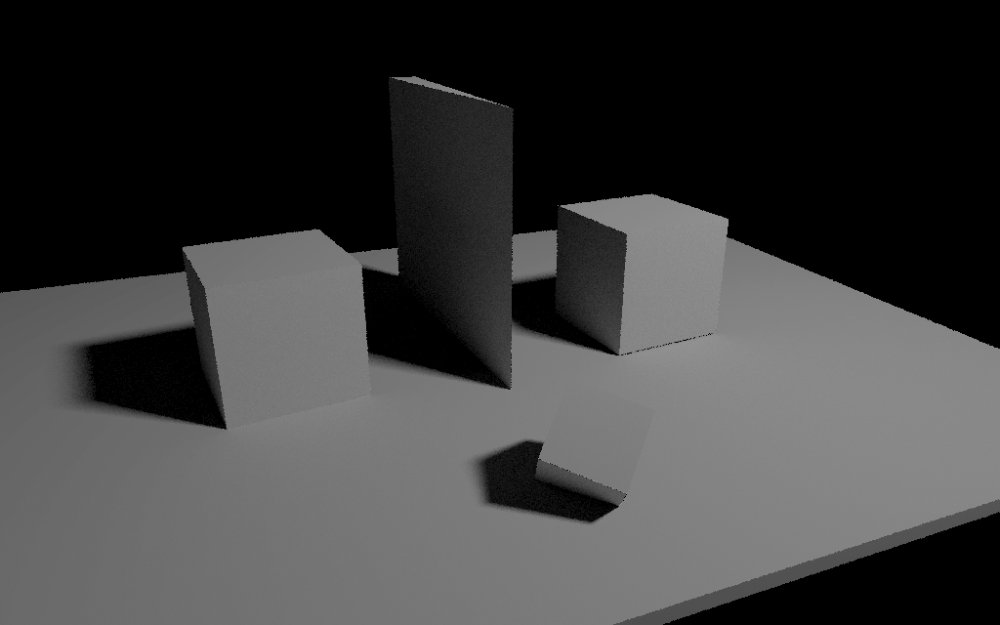
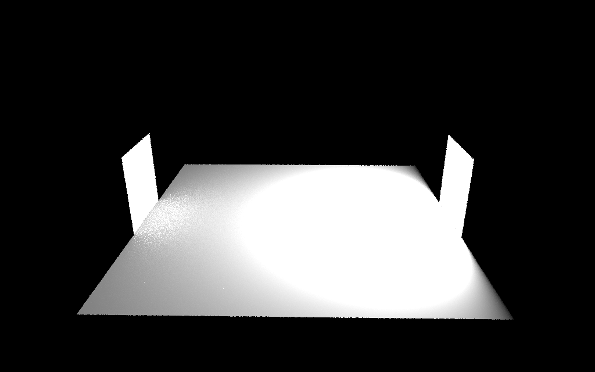

# M2 ID3D Synthèse d'Images 3D TPs
##### Auteur : Donnay Robin <donnay.robin@gmail.com>
*Ce readme a été rédigé en utilisant la visionneuse Markdown de Visual Studio Code, pour un résultat se rapprochant de la vision de l'auteur, nous vous conseillons de l'utiliser (Ctrl+Maj+V sur le ReadMe, ouvert, avec Visual Studio Code)*

# Introduction

Ce répertoire représente l'ensemble des Tps du cours de Synthèse d'Images 3D du M2 ID3D de l'Université Claude Bernard Lyon 1.   
Cinq executables sont proposés ici (deux présents de base avec [gkit2light](https://perso.univ-lyon1.fr/jean-claude.iehl/Public/educ/M1IMAGE/html/index.html), le code de départ des TPs, à savoir `bin/imageViewer.exe` et `bin/shader_kit.exe`, ils ne seront donc pas expliqué ici).
Les trois autres executables sont : 
- `bin/RayTraceCPU.exe`
- `bin/Direction.exe`
- `bin/RobotGL.exe`

# Compilation et prérequis 
Les librairies openGL, SDL2, SDL2_IMG et GLEW sont utilisées et doivent donc être installées avant de compiler ce projet.  
De plus, une directive OpenMP est présente pour utiliser tout les coeurs du CPU. Pour des performances maximales, il est conseillé d'avoir la librarie OpenMP d'installée également.  
La compilation ce fait avec cmake (version 3.13), une version équivalente ou ultérieur doit donc aussi être installée avant toute compilation.  
La compilation de tout les executables se fait à la racine du projet via la commande : `cmake . && make`  
Une fois la compilations faites, les cinq executables sont accessibles dans le dossier `bin/` mais il est conseillé de les lancer depuis la racine du projet.  

# RayTraceCPU

Partie la plus aboutie des TPs, elle a nécéssité une restructuration du code pour offrir un code "lisible" et paramétrable, autant que possible, pour voir et analyser le travail réalisé.

## Execution

L'executable de ce progamme est `bin/RayTraceCPU.exe`.  
De nombreux éléments peuvent être modifié grâce à la parametrisation de l'executable :
- `-imgWidth` : Le nombre de pixel en largeur de l'image
- `-imgHeight` : Le nombre de pixel en hauteur de l'image
- `-mesh` : Le fichier de l'objet de la scene
- `-orbiter` : Le fichier de la camera de la scene
- `-savePathAndFilename` : Le fichier (avec son chemin mais sans extension) dans lequel il faut sauvegarder les résultats
- `-directLightSaveFile` : Le fichier contenant la sauvegarde de l'éclairage direct pour seulement calculer l'eclairage indirect. Une sauvegarde est automatiquement faites avec l'extension ".taf" et utilise le paramètre `-SavePathAndFilename` comme nom de fichier)
- `-nbDirectRay` : Le nombre de rayon minimum pour calculer l'eclairage direct (si le nombre n'est pas suffisant pour être équitable entre toutes les sources, il est augmenté pour être équitable)
- `-nbIndirectRay` : Le nombre de rayon minimum pour calculer l'eclairage indirect 
- `-tonemapping` : Utilisation ou non de la compression Gamma 2.2 (le paramètre doit-être à 1 pour l'utiliser, 0 sinon)
- `-rayTraceTechnique` : La "technique" de raytracing à utiliser, basé sur les exercices du [TP](https://perso.univ-lyon1.fr/jean-claude.iehl/Public/educ/M2PROIMA/2019/tp2.html). Valeurs possibles : 
    - "Ex2"
    - "Ex5"
    - "Ex7" (utilisant l'eclairage direct "Ex5" par défault, sauf si une saubegarde d'éclairage direct lui est fournis)
    - "Ambiant"
- `-pdf` : La pdf utilisé pour la technique de ray tracing "Ex5", les valeurs possible étant : "AreaSources" et "CosAndDistance"
- `-trianglePointParametrization` : Définis quelle parametrisation doit être faites pour choisir un point aléatoirement sur un triangle : "square2triangle" ou "squareRoot"
- `-directionParametrization` : Définis quelle parametrisation doit être faites pour choisir un point aléatoirement sur un triangle : "uniform" ou "distributed"
- `-debug` : Mets les pixels dont la luminosité calculé dépasse les valeurs normal (r, g ou b > 1) en jaune. (le paramètre doit-être à 1 pour l'utilisé, 0 sinon)

Par exemple : `./bin/RayTraceCPU.exe -imgWidth=1920 -imgHeight=1080 -nbIndirectRay=1000 -mesh=data/RayTracingData/geometry.obj -orbiter=data/RayTracingData/geometryOrbiter.txt -tonemapping=1 -directLightSave=data/Result/TempRender.taf -savePathAndFilename=data/Result/Render -rayTraceTechnique=Ex7`, va générer le rendu de `l'éclairage indirect` du fichier `data/RayTracingData/geometry.obj` en utilisant le point de vue stocké dans le fichier `data/RayTracingData/geometryOrbiter.txt`. L'éclairage direct a été calculé auparavant et est stocké dans le fichier `data/Result/TempRender.taf` et ne sera pas recalculé. `1000` rayon seront utilisé pour calculé chaque pixel de l'image de taille `1920x1080`. Une fois l'éclairage calculé, une `compression Gamma 2.2` sera effectué. Enfin le résultat sera stocké dans les fichiers `data/Result/Render.png` et `data/Result/Render.hdr`.   
*Cet exemple ne fonctionne pas car la sauvegarde de l'éclairage direct n'existe pas.*  

Par défault, chaque paramètre est initialisé dans le fichier `src/RayTrace/CPU/mainCPU.cpp`.  
Les valeurs par défault sont : 
- `-mesh=data/RayTracingData/cornell.obj`
- `-orbiter=data/RayTracingData/cornellOrbiter.txt`
- `-pathAndFilenameForSave=data/Result/Render`
- `-rayTraceTechnique=Ex5`
- `-nbDirectRay=100`
- `-nbIndirectRay=100`
- `-imgWidth=1024`
- `-imgHeight=640`
- `-tonemapping=0`
- `-pdf=AreaSources`
- `-directLightSaveFile=`
- `-trianglePointParametrization=square2Triangle`
- `-directionParametrization=distributed`
- `-debug=0`

## Structure du code

Le code cette partie du programme se trouve dans les dossier `src/RayTrace/CPU/` et `src/Utils/`.  
Tout le code permettant le rendu se trouve dans la classe `RayTraceImageProcessing` contenu dans les fichiers `src/RayTrace/CPU/RayTraceImageProcessing.cpp` et `src/RayTrace/CPU/RayTraceImageProcessing.h`.  
Les fonctions utilitaires comme la selection de point aléatoire sur un triangle ou de direction aléatoire se trouve dans les fichiers `src/Utils/Utils.cpp` et `src/Utils/Utils.h`.

## Exercice 2 Matière

Rendu simpliste qui permet surtout de voir la scene, ses matériaux et le point de vue de l'orbiter.  

| Mesh          | Cornell Box | Geometry | Emission | Shadow | Secondary | 
| ------------- |   ---   |   ---   |   ---   |   ---   |   ---   |   ---   |
| Commande      |   `./bin/RayTraceCPU.exe -mesh=data/RayTracingData/cornell.obj -orbiter=data/RayTracingData/cornellOrbiter.txt -savePathAndFilename=doc/readme/Ex2_Cornell -rayTraceTechnique=Ex2`   |   `./bin/RayTraceCPU.exe -mesh=data/RayTracingData/geometry.obj -orbiter=data/RayTracingData/geometryOrbiter.txt -savePathAndFilename=doc/readme/Ex2_Geometry -rayTraceTechnique=Ex2`   |   `./bin/RayTraceCPU.exe -mesh=data/RayTracingData/emission.obj -orbiter=data/RayTracingData/emissionOrbiter.txt -savePathAndFilename=doc/readme/Ex2_Emission -rayTraceTechnique=Ex2`   |   `./bin/RayTraceCPU.exe -mesh=data/RayTracingData/shadow.obj -orbiter=data/RayTracingData/shadowOrbiter.txt -savePathAndFilename=doc/readme/Ex2_Shadow -rayTraceTechnique=Ex2`   |   `./bin/RayTraceCPU.exe -mesh=data/RayTracingData/secondary.obj -orbiter=data/RayTracingData/secondaryOrbiter.txt -savePathAndFilename=doc/readme/Ex2_Secondary -rayTraceTechnique=Ex2`   |
| Resultat      |      |      |      |      |      |

## Exercice 5 Eclairage Direct

L'éclairage direct est une partie importante du TP. Différents paramètres doivent rentrer en compte. 

Le premier exemple montre l'éclairage direct de toute les scenes exemples avec 100 rayons par pixel et une pdf utilisant la somme de l'aire des sources.  
Le rendu semble bon sur la CornellBox mais semble perdre en puissance quand la distance à la source est trop grande.   
Cela explique la tentative de changer la pdf pour utiliser le cosinus de la direction du rayon tiré aléatoirement et la distance à la source. Les résultats sont moins précis (malgré un nombre de rayon par pixel équivalent) mais avec une meilleur intensité globale.  
On note aussi qu'avec 1 rayon par soucres, les résultat reste assez précis.  
La compression gamma donne un résultat plus doux et plus agréable à l'oeil à mon goût.  
PS : La lumière de toute les scènes est la même afin de ne pas trop fausser les résultats.

| Mesh          | Cornell Box | Geometry | Emission | Shadow | Secondary | 
| ------------- |   ---   |   ---   |   ---   |   ---   |   ---   |   ---   |
| Commande de base     |   `./bin/RayTraceCPU.exe -mesh=data/RayTracingData/cornell.obj -orbiter=data/RayTracingData/cornellOrbiter.txt -savePathAndFilename=doc/readme/Ex5_Cornell -rayTraceTechnique=Ex5`   |   `./bin/RayTraceCPU.exe -mesh=data/RayTracingData/geometry.obj -orbiter=data/RayTracingData/geometryOrbiter.txt -savePathAndFilename=doc/readme/Ex5_Geometry -rayTraceTechnique=Ex5`   |   `./bin/RayTraceCPU.exe -mesh=data/RayTracingData/emission.obj -orbiter=data/RayTracingData/emissionOrbiter.txt -savePathAndFilename=doc/readme/Ex5_Emission -rayTraceTechnique=Ex5`   |   `./bin/RayTraceCPU.exe -mesh=data/RayTracingData/shadow.obj -orbiter=data/RayTracingData/shadowOrbiter.txt -savePathAndFilename=doc/readme/Ex5_Shadow -rayTraceTechnique=Ex5`   |   `./bin/RayTraceCPU.exe -mesh=data/RayTracingData/secondary.obj -orbiter=data/RayTracingData/secondaryOrbiter.txt -savePathAndFilename=doc/readme/Ex5_Secondary -rayTraceTechnique=Ex5`   |
| Résultat (sans option suplémentaire)     |      |      |      |      |      |  
| Résultat (`-nbDirectRay=1`)     |      |      |      |      |      | 
| Résultat (`-pdf=CosAndDistance`)     |      |      |      |      |      |
| Résultat (`-tonemapping=1`)     |      |      |      |      |      |

## Exercice 7

### Occultation Ambiante

L'occultation ambiante permet un rendu plus rapide que celui réalisé lors de l'Exercice 5 mais de nombreux problèmes subsistent, notamment la gestion des ombres puisque la lumières est "partout", les objets n'ont à propremement parlé pas de vraies zones d'ombres (sauf quand une zone est suffisament "fermée"). Néanmoins c'est une approche intéréssante lors du calcul d'éclairage extérieur avec une skybox lumineuse. En intérieur, sont intérêt semble assez limité. Un combinaison avec l'Exercice 5 pourrait régler les diffrents défaults de ces deux méthodes.  

| Mesh          | Cornell Box | Geometry | Emission | Shadow | Secondary | 
| ------------- |   ---   |   ---   |   ---   |   ---   |   ---   |   ---   |
| Commande      |   `./bin/RayTraceCPU.exe -mesh=data/RayTracingData/cornell.obj -orbiter=data/RayTracingData/cornellOrbiter.txt -savePathAndFilename=doc/readme/Ambiant_Cornell_distrib -rayTraceTechnique=Ambiant`   |   `./bin/RayTraceCPU.exe -mesh=data/RayTracingData/geometry.obj -orbiter=data/RayTracingData/geometryOrbiter.txt -savePathAndFilename=doc/readme/Ambiant_Geometry_distrib -rayTraceTechnique=Ambiant`   |   `./bin/RayTraceCPU.exe -mesh=data/RayTracingData/emission.obj -orbiter=data/RayTracingData/emissionOrbiter.txt -savePathAndFilename=doc/readme/Ambiant_Emission_distrib -rayTraceTechnique=Ambiant`   |   `./bin/RayTraceCPU.exe -mesh=data/RayTracingData/shadow.obj -orbiter=data/RayTracingData/shadowOrbiter.txt -savePathAndFilename=doc/readme/Ambiant_Shadow_distrib -rayTraceTechnique=Ambiant`   |   `./bin/RayTraceCPU.exe -mesh=data/RayTracingData/secondary.obj -orbiter=data/RayTracingData/secondaryOrbiter.txt -savePathAndFilename=doc/readme/Ambiant_Secondary_distrib -rayTraceTechnique=Ambiant`   |
| Resultat (Direction distribuée)     |      |      |      |      |      |
| Resultat (`-directionParametrization=uniform`)     |      |      |      |      |      |

### Eclairage Indirecte

Le calcul de l'éclairage indirect est assez rapide à réaliser une fois que l'occultation ambiante est faite.  
Elle apporte un meilleur réalisme à la scène même si quelques problèmes reste encore à régler.   

| Mesh          | Cornell Box | Geometry | Emission | Shadow | Secondary | 
| ------------- |   ---   |   ---   |   ---   |   ---   |   ---   |   ---   |
| Commande      |   `./bin/RayTraceCPU.exe -mesh=data/RayTracingData/cornell.obj -orbiter=data/RayTracingData/cornellOrbiter.txt -savePathAndFilename=doc/readme/Ex7_Cornell_Ex5_noSave -rayTraceTechnique=Ex7`   |   `./bin/RayTraceCPU.exe -mesh=data/RayTracingData/geometry.obj -orbiter=data/RayTracingData/geometryOrbiter.txt -savePathAndFilename=doc/readme/Ex7_Geometry_Ex5_noSave -rayTraceTechnique=Ex7`   |   `./bin/RayTraceCPU.exe -mesh=data/RayTracingData/emission.obj -orbiter=data/RayTracingData/emissionOrbiter.txt -savePathAndFilename=doc/readme/Ex7_Emission_Ex5_noSave -rayTraceTechnique=Ex7`   |   `./bin/RayTraceCPU.exe -mesh=data/RayTracingData/shadow.obj -orbiter=data/RayTracingData/shadowOrbiter.txt -savePathAndFilename=doc/readme/Ex7_Shadow_Ex5_noSave -rayTraceTechnique=Ex7`   |   `./bin/RayTraceCPU.exe -mesh=data/RayTracingData/secondary.obj -orbiter=data/RayTracingData/secondaryOrbiter.txt -savePathAndFilename=doc/readme/Ex7_Secondary_Ex5_noSave -rayTraceTechnique=Ex7`   |
| Resultat (combiné avec eclairage direct Ex5)     |      |      |      |      |      |
| Resultat (combiné avec sauvegarde éclairage direct Ex5 `-directLightSaveFile=doc/readme/Ex5_mesh.taf`)     |      |      |      |      |      |
| Resultat (combiné avec eclairage direct Ex5 et `-directionParametrization=uniform`)     |      |      |      |      |      |
| Resultat (combiné avec éclairage direct Ex5 et `-tonemapping=1`)     |      |      |      |      |      |

## Conclusion du Ray Tracing

Le rendu par ray tracing est lent mais les résultats obtenus sont très rapidement réaliste.  
De nombreuses améliorations existent pour obtenir un rendu toujours plus rapide et proche de la réalité.  
J'ai adoré travaillé sur cette partie car chaque lecture d'article offre de nouvelle perspective dans la qualité du rendu.  

# Direction

Preuve du bon fonctionnement d'une partie du code du projet précédent, cet executable est assez peu intéréssant. Il permet néanmoins de voir la différence entre les deux méthodes de générations de directions (uniformes ou distribuées)

## Execution

L'executbale de ce progamme est `bin/Direction.exe`.  
Il est possible de choisir le type de génération de direction souhaité : 
- `./bin/Direction.exe 1` ou `./bin/Direction.exe` permet de tester une génération des directions uniformes
- `./bin/Direction.exe 0` permet de tester une génération des directions distribuées  
Il est conseillé afin de lancer le programme, voir les résultat et de ne pas conserver les images générées d'utiliser la commande : `./bin/Direction.exe 1 && ./bin/imageViewer.exe sphere.hdr density.hdr && rm sphere.hdr density.hdr`

## Résultat

|  Génération de direction uniformes | Génération de directions distribuées |
|   ---   |   ---   |
|   `./bin/Direction.exe 1`   |   `./bin/Direction.exe 0`   |
|      |      |

# RobotGL

Cette partie est la moins travaillée de toute. Elle présente un interêt limité car seulement la partie animation du Robot a été codé. Le seul point positif étant que peut importe le nombre robot, le temps de calcul est presque le même gràce à une utilisation intelligente des buffers et des shaders.  
Execution : `bin/RobotGL.exe`

